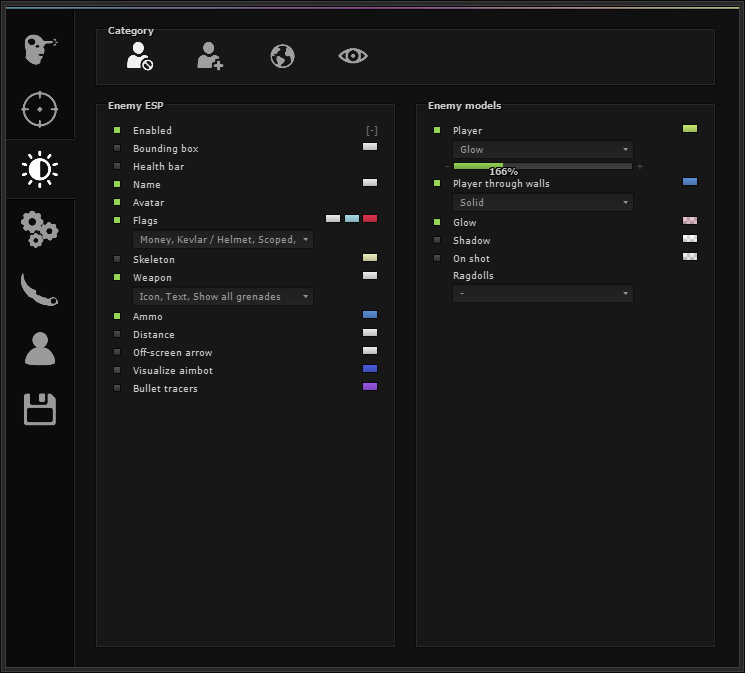
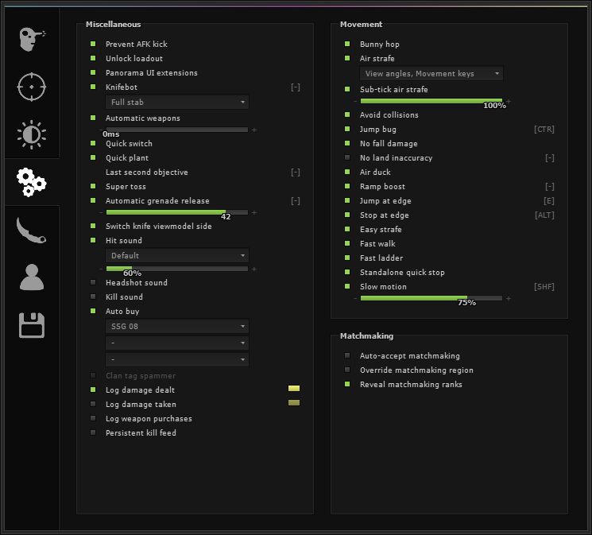
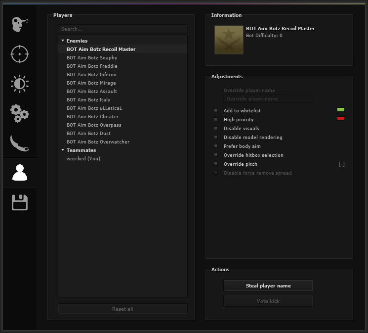

# skeet menu

A pixel-accurate remake of the gamesense (skeet) menu, written in C++ with Dear ImGui, GLFW and OpenGL.
It is UI only: there is no cheat code in this project.



| Misc | Players |
| --- | --- |
|  |  |

## Features

- All seven tabs: Rage, Legit, Visuals, Misc, Skins, Players and Config.
- Text drawn with Verdana through GDI, matched 1:1 against native screenshots.
- Working widgets: checkboxes, sliders, combos, multi-combos, colour pickers, keybinds, text fields,
  lists, the weapon-type popup and collapsible player lists.
- Native 745x673 window, which you can drag by the top bar.

## Build

You need CMake 3.16+ and a C++17 compiler (Visual Studio 2022 or MinGW). Dear ImGui, GLFW, stb and
FreeType are downloaded by CMake on the first configure.

```bash
cmake -S . -B build
cmake --build build --config Release
```

The exe is written to `build/Release/skeet_menu.exe` (or `build/skeet_menu.exe` with single-config
generators), and `assets/` is copied next to it.

### Command-line flags

| Flag | Effect |
| --- | --- |
| `--tab N` | Start on tab N (0 Rage … 6 Config) |
| `--screenshot file.ppm` | Render one frame to a file and exit |
| `--scale S` | Draw the menu at scale S |

## Credits

Made by lucas ([github.com/lxcasfr](https://github.com/lxcasfr)). It is open source, so if you
paid for this GUI you were scammed.
